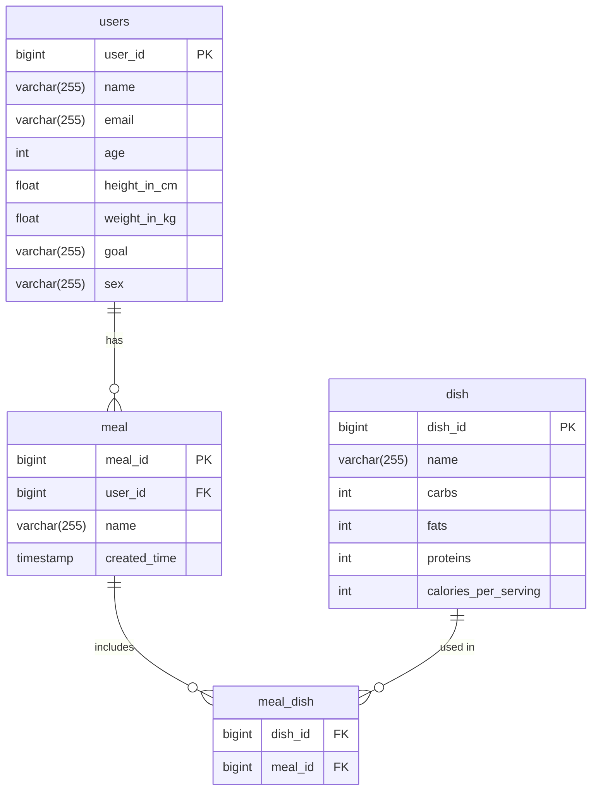

# Multiuser Calorie-tracking Application 🚀

*A calorie-tracking web app with meal analysis to help users maintain a healthy diet*

## 📌 Table of Contents
- [Key Features](#-key-features)
- [Tech Stack](#-tech-stack)
- [API Documentation](#api-documentation)
- [Database Schema](#-database-schema)
- [Quick Start](#-quick-start)
- [Testing](#-testing)
- [Deployment](#-deployment)
- [Contacts](#-contacts)

## 🌟 Key Features
### User Management:
- ✅ User registration
- 🧮 Automatic daily goal specific calorie target calculation (Harris-Benedict formula)
  
### Meal Tracking
- 🍽️ Create dishes with macronutrients
- 🕒 Add meals with list of selected dishes

### Reports
- 📊 Daily report (meals and total calories)
- ✅ Check if within daily calorie target
- 🗓️ Meal history by day

## 🛠 Tech Stack
| Category       | Technologies                          |
|----------------|-----------------------------------|
| **Backend**     | Java 17, Spring Boot 3, Web, Data JPA, Validation|
| **Database**| PostgreSQL, Liquibase             |
| **Infrastructure** | Docker, Docker Compose       |
| **Build Tool**     | Maven|
| **Testing** | JUnit 5, Mockito, Testcontainers |

## API Documentation

[](https://documenter.getpostman.com/view/41252659/2sB2cUA2yf)

## 📊 Database Schema



## ⚡ Quick Start
1. Clone repository:
```bash
git clone https://github.com/LoucterSo/fitness-app
cd fitness-app
```

2. Start the application:
```bash
docker-compose -f docker-compose-dev.yml up --build
```
3. Stop the application:
```bash
docker-compose -f docker-compose-dev.yml down -v
```

## 🧪 Testing
```bash
# Unit-tests
./mvnw test
```

## 🐳 Deployment
### 1. Local execution (without Docker):
Start application with the 'local' profile and change the necessary properties in application-local.yml
```properties
spring.profiles.active=local
```

### 2. Development mode:
```bash
docker-compose -f docker-compose-dev.yml up --build
```

### 3. Production mode:
*Do not forget to add the .env file with the necessary properties to the root of the project*
```bash
docker-compose -f docker-compose-prod.yml up --build
```

## 📧 Contacts
- Author: Vladislav Gorelkin
- 📧 Email: vlad_gorelkin@inbox.ru | loucterso@gmail.com
- 💻 GitHub: [LoucterSo](https://github.com/LoucterSo)
